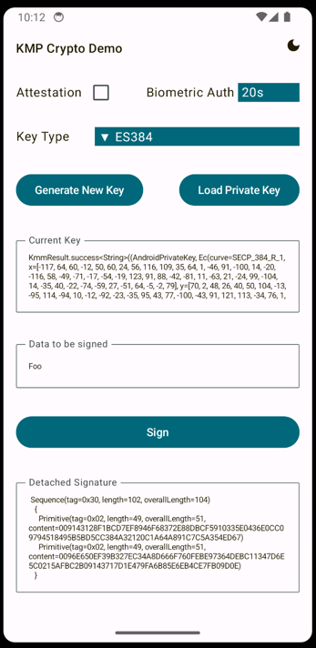

# KMP Crypto Demo Multiplatform (iOS, Android JVM) App

This app showcases the KMP Crypto provider (currently supporting onl EC crypto) on the desktop, on Android and on iOS.
It is possible to generate key pairs and sign data. Verification is not implemented in the demo app.

Attested keys can only be generated, when using P-256 keys, due to an iOS limitation. For reasons of consistency, Android attested keys are also fixed to P-256.
The JVM does not support attestation.

Android and iOS support mandatory authentication for key usage. While somewhat similar functionality can be achieved on both platforms, iOS comes with some peculiarities.
Most prominently: It is possible to specify a max validity duration of an authentication context. This property, however, has jwf semantics, since a once authenticated LAContext will remain in this state for eternety.
Hence, reauthentication needs to be implemented manually.

The BiometricAuthAdapter on Android requires some more polishing, but it should clearly convey the underlying idea even in its current state.

## Before running!
 - check your system with [KDoctor](https://github.com/Kotlin/kdoctor)
 - install JDK 17 on your machine
 - add `local.properties` file to the project root and set a path to Android SDK there

### Android
To run the application on android device/emulator:  
 - open project in Android Studio and run imported android run configuration

To build the application bundle:
 - run `./gradlew :composeApp:assembleDebug`
 - find `.apk` file in `composeApp/build/outputs/apk/debug/composeApp-debug.apk`

### iOS
To run the application on iPhone device/simulator:
 - Open `iosApp/iosApp.xcproject` in Xcode and run standard configuration
 - Or use [Kotlin Multiplatform Mobile plugin](https://plugins.jetbrains.com/plugin/14936-kotlin-multiplatform-mobile) for Android Studio

